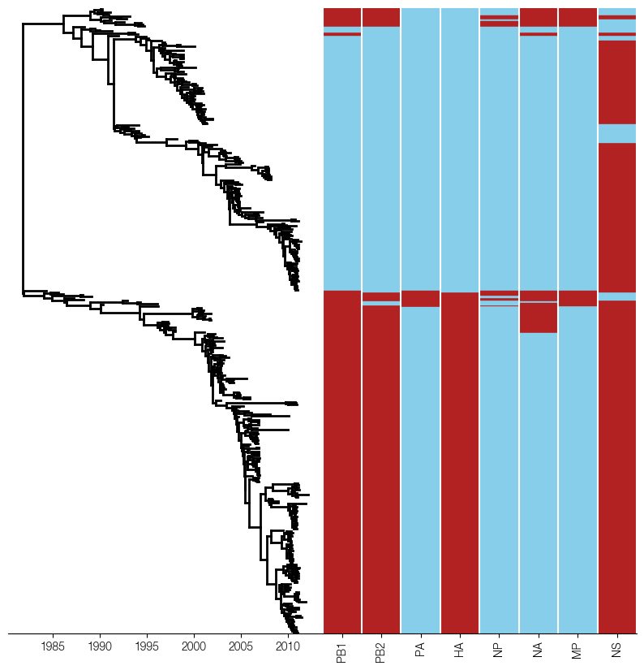

tree matrix
===========

.. raw:: html

   

     <a href="../_static/examples/influenza-b-virus/tree-matrix.py" download>Download python source</a>
   

Code
----

.. code-block:: python

   import csv

   import baltic as bt
   from baltic import bt_utils
   from baltic import curonia

   import matplotlib as mpl
   from matplotlib import pyplot as plt
   from matplotlib.gridspec import GridSpec

   mpl.use("Agg")
   ##############

   ll = bt.io.load_nexus('InfB_HAt_ALLs1.mcc.tre', 'time', tipRegex=r'_([0-9\-]+)$')
   ll.treeStats()

   segments=['PB1','PB2','PA','HA','NP','NA','MP','NS']

   labels = {seg: {} for seg in segments}
   for seg in segments:
       for l in csv.DictReader(open(f"InfB_{seg}_subtypes.txt", 'r'), delimiter='\t'):
           labels[seg][l['traits']] = l[seg]
   #############

   fig = plt.figure(figsize=(10, 10), facecolor='w')
   gs = GridSpec(1, 2, width_ratios=[1, 1], wspace = 0.0)

   ax = plt.subplot(gs[0])
   ax2 = plt.subplot(gs[1])

   #########
   yamColour = 'skyblue'
   vicColour = 'firebrick'

   colourDict = {seg: {'V': vicColour, 'Y': yamColour} for seg in segments} ## every segment gets the same colour map

   curonia.plot_tree_matrix(treeAx=ax, matrixAx=ax2, tree=ll, labelDict=labels, colourDict=colourDict, columnOrder=segments)

   ax2.vlines(range(len(segments) + 1), ymin=0, ymax=ll.ySpan, color='w') ## add separators for columns

   bt_utils.clean_axes(ax, hideSpines=['left', 'top', 'right'], removeTickLabels='y') ## clean both axes
   bt_utils.clean_axes(ax2, hideSpines=['left', 'top', 'right'], removeTickLabels='y')

   plt.savefig('tree-matrix.png', bbox_inches='tight')
