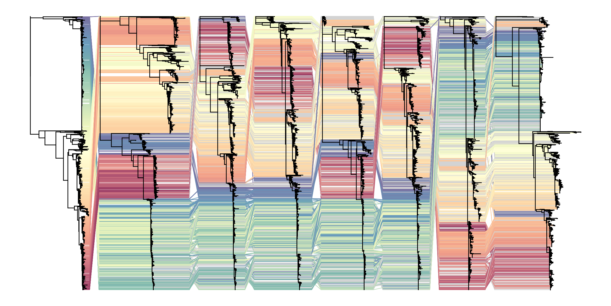

nextstrain avian flu tanglegram
===============================

.. raw:: html

   

     <a href="../_static/examples/nextstrain/nextstrain-avian-flu-tanglegram.py" download>Download python source</a>
   

Code
----

.. code-block:: python

   import baltic as bt
   from baltic import bt_utils
   from baltic import curonia

   import matplotlib as mpl
   from matplotlib import pyplot as plt
   from matplotlib.gridspec import GridSpec

   # import numpy as np

   mpl.use("Agg")
   #########

   segments = ['PB1', 'PB2', 'PA', 'HA', 'NP', 'NA', 'MP', 'NS']
   trees = {}

   for seg in segments:
       ll, meta = bt.io.load_JSON(f"avian-flu_h5n1_{seg.lower()}_2y.json", 'divergence') ## this import from URL also works

       ll.sort_branches()
       trees[seg] = ll

       ll.treeStats()

   print(len(trees))

   ####### this does plotting

   fig = plt.figure(figsize=(30, 15), facecolor='w')
   gs = GridSpec(1, 1)

   ax = plt.subplot(gs[0])
   #########

   treeOrder = [trees[seg] for seg in segments]
   curonia.plot_tangled_chain(ax=ax, treeList=treeOrder)

   bt_utils.clean_axes(ax)
   plt.savefig('nextstrain-avian-flu-tanglegram.png', bbox_inches='tight')
